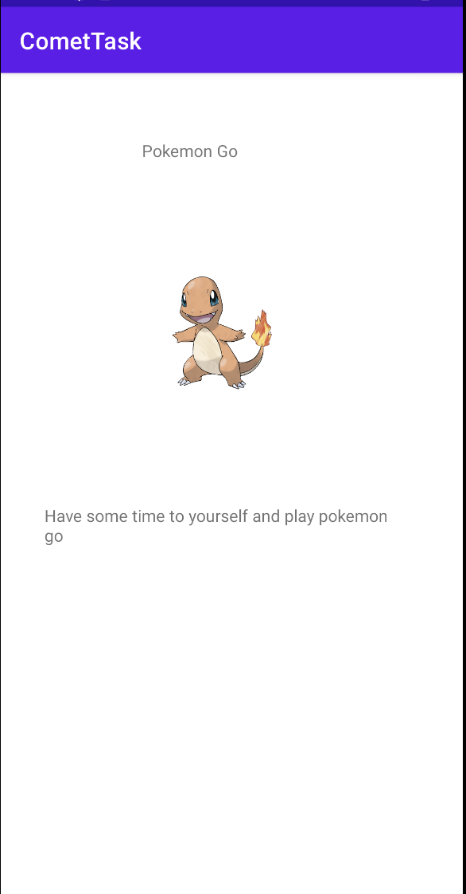

# comettask
A place to organize your tasks

[Link to raw APK](app/build/intermediates/apk/debug/app-debug.apk)

You are able to add tasks with a name, the description, join a team, and set an image for the task.

Organize simple tasks that your have to complete through out your day.

Task management application that allows for the user to create tasks. The name, description, and current status will be saved. In addition, the user can select a photo from their downloads to images to accompany the task. Finally, set a task to a team to help organize your tasks that build up during the day.

You are not able to delete tasks, so don't mess up while creating them. View the tasks on the home page. Go into the account settings to select which tasks are being presented. In addition, you can change the greeting in the setting page.

The app has no security, but you can create an account. This is not necessary, but input your valid email to receive a verification number that you can input. You can navigate to a sign in page or sign out. However, know that all users tasks will be available to you no matter sign it state you currently have. However, the dashboard only has the sign-in and sign-up if you are not currently signed in. While signed in, only the sign out button is showing.

This is a basic rendering of the home screen for my application.

